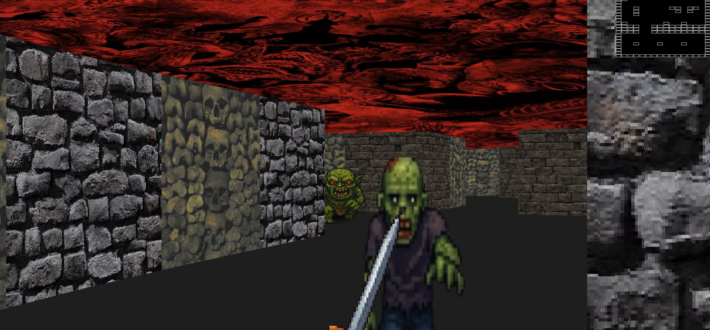
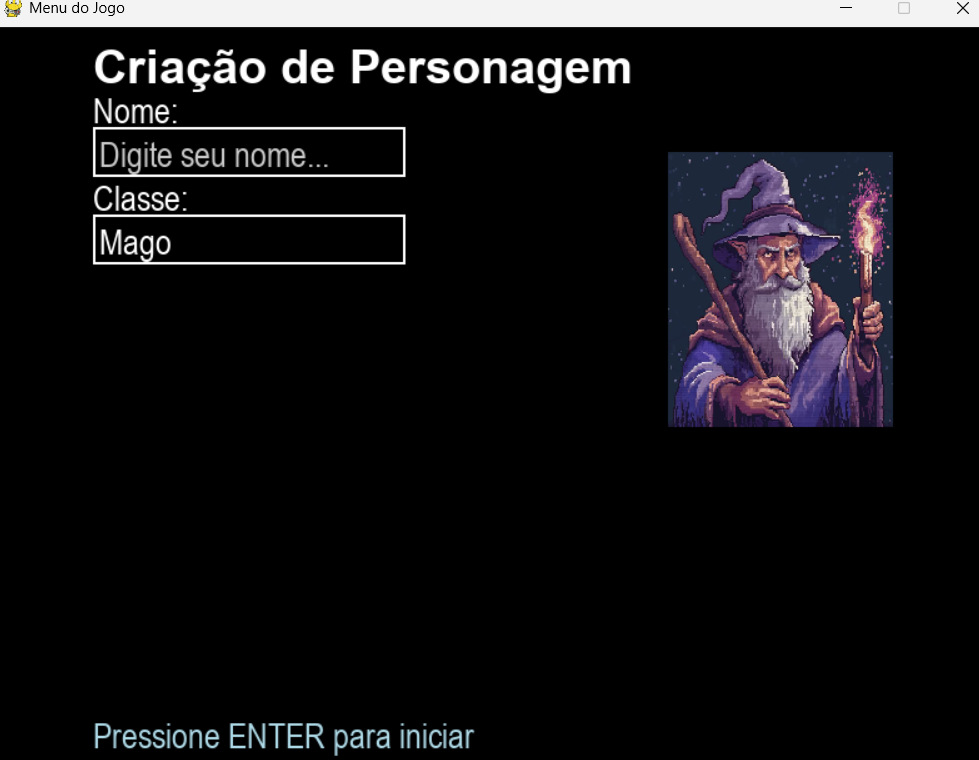

# Dungeon game baseado em DOOM clone style 3d (raycasting) in Python

Control: 'WASD' + mouse





Menu:




# In-Dungeon-DOOM

Este é um jogo de tiro em primeira pessoa (FPS) com elementos de RPG, inspirado na imersão apocalíptica do clássico retrô Doom. O jogo oferece uma experiência nostálgica com visual graficos em pixel art pseudo 3D gerado por raycasting.

O jogador pode escolher entre três classes distintas — mago, guerreiro ou atirador — cada uma com armas e estilos de combate únicos. O jogo conta com sons personalizados para cada arma, mini mapa dinâmico para navegação em tempo real, e um sistema simples de menu para facilitar a seleção e imersão no universo do jogo.

---

## Como Executar

### 1. Execução recomendada: `setup.py`

O script `setup.py` realiza automaticamente os seguintes passos:

- Cria o ambiente virtual `.venv`
- Instala as dependências do projeto
- Executa o jogo uma única vez

Para executar:

```bash
python setup.py
```

Após essa primeira execução, use um dos métodos abaixo para rodar o jogo novamente.

---

### 2. Execução manual com o ambiente virtual já criado

Ative o ambiente virtual e execute o jogo:

**Diretamente com o Python do ambiente:**

```powershell
.venv\Scripts\python.exe main.py
```

**ou no PowerShell (Windows):**

```powershell
.venv\Scripts\Activate.ps1
python main.py
```


## Jogabilidade

Ao iniciar o jogo, o menu permite inserir o nome do jogador e escolher uma das classes disponíveis. Cada classe possui uma arma e sons próprios. Para melhorar jogabilidade é recomendado colocar o jogo em tela cheia no inicio. 

### Classes disponíveis:

- Mago: Bola de fogo (fireball)
- Guerreiro: Espada (slash)
- Atirador: Espingarda (shotgun)

### Controles

| Tecla             | Função            |
|-------------------|-------------------|
| W A S D           | Movimentação      |
| Mouse             | Direção/Mira      |
| Clique esquerdo   | Ataque            |
| ESC               | Pausar/Menu       |

---

## Estrutura do Projeto

```
Project-Dungeon/
├── main.py               # Inicia o jogo
├── map.py                # Lógica do mapa e minimapa
├── player.py             # Jogador e movimentação
├── weapon.py             # Armas e efeitos visuais
├── sound.py              # Sons e música de fundo
├── object_handler.py     # NPCs e objetos interativos
├── menu.py               # Menu principal
├── setup.py              # Setup automático (env + execução)
├── requirements.txt      # Dependências do projeto
├── resources/            # Imagens, sons e sprites
└── .venv/                # Ambiente virtual (não versionado)
```

---

## Requisitos

- Python 3.10 ou superior
- Pygame

Para instalar manualmente as dependências(se nao tiver conseguido setup):

```bash
pip install -r requirements.txt
```

---

## Dicas e Problemas Comuns

- A biblioteca pygame pode ter alguns conflitos de compatibilidade dependendo da versão do python no sistema. Possuir a biblioteca instalada não garente compatibilidade com a versão usada no jogo portando é necessario a criação de um ambiente virtual integrado no diretorio do projeto, a IDE pode fazer esse processo automaticamente mas é fortemente recomendado a execução correta do **setup.py** para desburocratizar esse processo,  

- Lembrando que para rodar o jogo novamente, main.py isolado não vai funcionar é preciso especificar o ambiente venv
```
.venv\Scripts\python.exe main.py
```

---

## Melhorias Futuras (Backlog de Features)

Essas são sugestões de implementação para evolução do jogo:

- **Algoritmo de geração procedural de mapas**  
  Usar algoritmos para criar mapas diferentes a cada partida, com paredes e obstáculos responsivos.

- **Sistema de objetivos e troca de fases**  
  Criar um "goal" no mapa (por exemplo, uma saída ou item especial). Ao alcançá-lo, carregar um novo mapa ou reiniciar com mais dificuldade.

- **Melhorar menu e configurações**  
  Incluir opções de volume, resolução, modo tela cheia.

- **Textura do chão com iluminação realista**  
  Aplicar interpolação de luz com base na distância da fonte, adaptando o sombreamento no `raycasting` para o piso.

- **Portas, janelas e espelhos**  
  Estender o algoritmo de raycasting para reconhecer superfícies refletoras e interativas com raio ajustável por tipo de material.

- **Combate e projéteis visuais aprimorados**  
  Incluir sprites animados de projéteis, colisões visuais e feedback de dano nos inimigos.

- **Sistema de drop e evolução de armas**  
  Implementar drops aleatórios e upgrades com base na performance do jogador ou fases avançadas.

- **Delay personalizável em ataques**  
  Controlar o tempo de espera entre ataques por tipo de arma/classe, em vez de depender apenas de evento único por clique.

- **Munição, mana e vigor**  
  Limitar ataques com recursos que se esgotam e recarregam, como munição para armas ou barra de mana para magias.

- **Novos tipos de inimigos e classes de jogador**  
  Introduzir variedade de comportamentos e habilidades, com inimigos de longo alcance, evasivos, etc.

- **Armadilhas e debuffs**  
  Criar áreas que causam lentidão, dano ao longo do tempo, ou que afetam temporariamente o jogador.

- **Sons detalhados para cada interação**  
  Diferenciar sons de ataque, dano, movimentação, coleta e interface para maior imersão.

- **Melhoria no design e movimentação de objetos**  
  Trabalhar melhor nas sprites, física de objetos e fluidez nas animações de movimentação.

- **Storyboards e cutscenes**  
  Adicionar cenas introdutórias com base na escolha de personagem usando `pygame.Surface` e transições suaves.

- **Tela inicial (Start Game)**  
  Exibir uma capa ou título antes de entrar diretamente no menu principal, com opção de "Iniciar Jogo".

---

## Créditos e Inspiração

Este projeto foi inspirado nas ideias apresentadas no canal **Coder Space**, como base para a estrutura de raycasting e organização do jogo.

Os **designs e pixel arts** foram criadas com o auxílio de geração de imagem **ChatGPT**, bem como concept arts de mobs e desing de armas.


--- **SAULO**  

